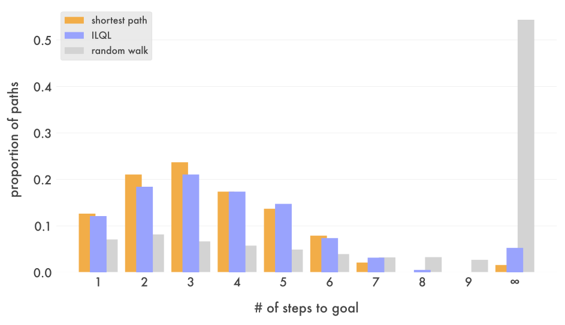

Simplified implementation of [Implicit Language Q Learning (Snell et. al 2022)](https://sea-snell.github.io/ILQL_site/) ([official](https://github.com/Sea-Snell/Implicit-Language-Q-Learning/), [paper](https://arxiv.org/abs/2206.11871))

Evaluating on Graph Shortest Path task from [Decision Transformer (Lili Chen et. al 2021)](https://arxiv.org/abs/2106.01345):

where for each random graph, a transformer is trained to find optimal trajectories using only 1000 random walks.
